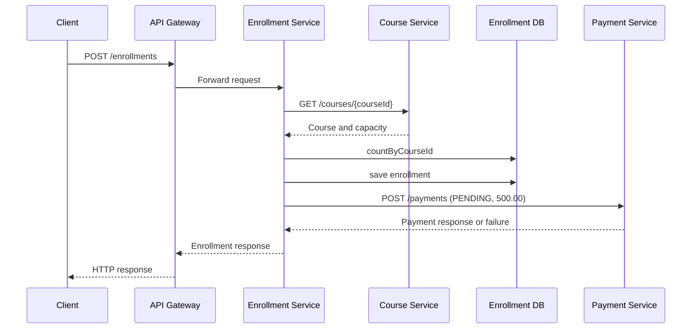

# AcademiaX Project Review Document

**Project:** AcademiaX
**Type:** Spring Boot and Spring Cloud microservices platform for academic management
**Review scope:** Source code and tracked configuration in this repository
**Review date:** 2026-09-22

## 1. Executive Summary

AcademiaX separates academic-management responsibilities into independently runnable services. The platform supports authentication, user profiles, courses, enrollments, and payment records. Eureka provides service discovery, the API Gateway is the intended client entry point, OpenFeign provides synchronous service-to-service calls, PostgreSQL stores persistent data, and JWT provides gateway authentication.

The strongest demonstration flow is:

```text
Client -> API Gateway -> Enrollment Service
                         -> Course Service: verify course and capacity
                         -> Enrollment database: save enrollment
                         -> Payment Service: create PENDING payment
```

The project is suitable as a microservices learning and demonstration project. Before production use, the main gaps to address are secret management, authorization, request validation, transaction consistency, concurrent capacity enforcement, remote-call resilience, database migrations, and functional test coverage.

## 2. Business Objective

The platform models a simplified academic institution workflow:

- Register and authenticate platform users.
- Maintain user profile records for students, instructors, and other roles.
- Create and manage courses with instructor and capacity data.
- Enroll a student in a course after checking that the course exists and has capacity.
- Automatically initiate a pending payment after enrollment.
- Expose a single gateway endpoint for clients and discover service instances dynamically.

## 3. Technology Stack

| Area | Technology used | Purpose |
|---|---|---|
| Language/runtime | Java 25 | Application runtime and compilation target |
| Application framework | Spring Boot 4.1.1 | REST services, dependency injection, configuration |
| Cloud framework | Spring Cloud 2025.1.3 | Gateway, Eureka client/server, load balancing, Feign |
| API gateway | Spring Cloud Gateway MVC | Routing and gateway-level authentication |
| Discovery | Netflix Eureka | Service registration and lookup |
| Persistence | Spring Data JPA and Hibernate | Entity mapping and repository access |
| Database | PostgreSQL | Persistent data storage |
| Service calls | Spring Cloud OpenFeign | Declarative Course and Payment calls |
| Security | Spring Security, BCrypt, JJWT | Password hashing and JWT creation/verification |
| Build | Maven and Maven Wrapper | Packaging services as executable WAR files |
| Operations | Spring Boot Actuator | Health and info endpoints |

## 4. Service Inventory

| Component | Spring application name | Port | Main responsibility | Persistent data |
|---|---|---:|---|---|
| Eureka Server | `eureka-server` | 8761 | Service registry and discovery dashboard | None |
| API Gateway | `api-gateway` | 8080 | Public entry point, routing, JWT filter | None |
| Auth Service | `auth-service` | 8081 | Registration, login, BCrypt, JWT issuance | `auth_users` |
| User Service | `user-service` | 8082 | User profile CRUD | `users` |
| Course Service | `course-service` | 8083 | Course CRUD and capacity | `courses` |
| Enrollment Service | `enrollment-service` | 8084 | Enrollment CRUD and enrollment orchestration | `enrollments` |
| Payment Service | `payment-service` | 8085 | Payment record CRUD | `payments` |

All application services register with Eureka at `http://localhost:8761/eureka/`. The gateway routes by Eureka service name rather than fixed host/port URLs. The launcher starts Eureka, then services, then the gateway, with a two-second delay between process starts.

## 5. Architecture and Request Routing

```text
                            +----------------+
                            | Eureka Server  |
                            | localhost:8761|
                            +--------+-------+
                                     |
               registers/discovers   |
                                     v
Client --> API Gateway :8080 --> Eureka load-balanced route
                                  |       |       |       |
                                  v       v       v       v
                              Auth :8081 User :8082 Course :8083
                                  |       |       |       |
                                  +-------+-------+-------+
                                          |
                               Enrollment :8084
                                  |              |
                       Feign GET course     Feign POST payment
                                  v              v
                              Course :8083   Payment :8085

All data-owning services use PostgreSQL database `skill2`.
```

### Gateway route map

Routes preserve the incoming path; there is no path rewrite in `GatewayConfig`.

| Incoming path | Eureka destination |
|---|---|
| `/auth/**` | `AUTH-SERVICE` |
| `/users/**` | `USER-SERVICE` |
| `/courses/**` | `COURSE-SERVICE` |
| `/enrollments/**` | `ENROLLMENT-SERVICE` |
| `/payments/**` | `PAYMENT-SERVICE` |

Gateway operational endpoints are handled by the gateway itself:

- `GET /gateway` -> `AcademiaX API Gateway is running`
- `GET /gateway/status` -> `AcademiaX API Gateway is healthy`
- `GET /actuator/health` -> Spring Boot health response

## 6. Complete Endpoint Catalog

The URLs below are shown through the API Gateway at `http://localhost:8080`. The same business paths are also available on the direct service ports unless the caller is prevented by network policy.

### 6.1 Authentication endpoints

#### `POST /auth/register`

Registers an authentication user and returns a JWT.

Request body:

```json
{
  "username": "student1",
  "password": "Passw0rd!",
  "role": "STUDENT"
}
```

Behavior:

1. Looks up the username.
2. Rejects a duplicate username with `409 Conflict` through the auth exception handler.
3. Encodes the password with BCrypt.
4. Saves an `AuthUser`.
5. Creates a seven-day JWT containing the username and role.

Successful response shape:

```json
{
  "token": "<jwt>",
  "username": "student1",
  "role": "STUDENT"
}
```

#### `POST /auth/login`

Authenticates an existing user.

Request body:

```json
{
  "username": "student1",
  "password": "Passw0rd!"
}
```

A successful login returns the same token response shape as registration. Invalid username/password currently throws a generic runtime exception; the implementation should map this to `401 Unauthorized` rather than relying on the default error behavior.

### 6.2 User endpoints

Service: User Service, direct port `8082`, gateway prefix unchanged.

| Method | Path | Purpose | Request body | Success result |
|---|---|---|---|---|
| POST | `/users` | Create profile | `name, email, phone, role, department, studentId, instructorId` | Created `UserResponse` |
| GET | `/users` | List profiles | None | List of `UserResponse` |
| GET | `/users/{id}` | Read one profile | None | One `UserResponse` |
| PUT | `/users/{id}` | Update profile | `name, phone, department` | Updated `UserResponse` |
| DELETE | `/users/{id}` | Delete profile | None | `User deleted successfully` |

Important update behavior: the user update method changes only name, phone, and department. Email, role, student ID, and instructor ID are not changed by this endpoint.

Example create request:

```json
{
  "name": "Asha Kumar",
  "email": "asha@example.com",
  "phone": "5550101",
  "role": "STUDENT",
  "department": "Computer Science",
  "studentId": "STU1001",
  "instructorId": null
}
```

### 6.3 Course endpoints

Service: Course Service, direct port `8083`.

| Method | Path | Purpose | Request body | Success result |
|---|---|---|---|---|
| POST | `/courses` | Create course | `title, instructor, capacity` | Created `CourseResponse` |
| GET | `/courses` | List courses | None | List of `CourseResponse` |
| GET | `/courses/{id}` | Read one course | None | One `CourseResponse` |
| PUT | `/courses/{id}` | Replace course values | `title, instructor, capacity` | Updated `CourseResponse` |
| DELETE | `/courses/{id}` | Delete course | None | `Course deleted successfully` |

Example request:

```json
{
  "title": "Distributed Systems",
  "instructor": "Dr. Mehta",
  "capacity": 30
}
```

Capacity values greater than zero are enforced during enrollment. The current source treats a capacity of zero as unlimited because the check is conditional on `capacity > 0`.

### 6.4 Enrollment endpoints

Service: Enrollment Service, direct port `8084`.

| Method | Path | Purpose | Request body | Success result |
|---|---|---|---|---|
| POST | `/enrollments` | Enroll a student | `studentId, courseId, status` | Created `EnrollmentResponse` |
| GET | `/enrollments` | List enrollments | None | List of `EnrollmentResponse` |
| GET | `/enrollments/{id}` | Read one enrollment | None | One `EnrollmentResponse` |
| PUT | `/enrollments/{id}` | Update enrollment | `studentId, courseId, status` | Updated `EnrollmentResponse` |
| DELETE | `/enrollments/{id}` | Delete enrollment | None | `Enrollment deleted successfully` |

Example request:

```json
{
  "studentId": 1001,
  "courseId": 1,
  "status": "PENDING"
}
```

Create behavior:

1. Feign calls `GET /courses/{courseId}` on Course Service.
2. If a course exists and has positive capacity, the service counts rows using `countByCourseId`.
3. If the count is at least capacity, the request fails with a client-visible business error.
4. The enrollment is saved.
5. Feign calls Payment Service with the saved enrollment ID, amount `500.00`, and status `PENDING`.
6. The enrollment response is returned.

Payment initiation is best-effort in the current implementation. If the payment call fails, the enrollment remains saved and the exception is logged to stderr.

### 6.5 Payment endpoints

Service: Payment Service, direct port `8085`.

| Method | Path | Purpose | Request body | Success result |
|---|---|---|---|---|
| POST | `/payments` | Create payment record | `enrollmentId, amount, paymentStatus` | Created `PaymentResponse` |
| GET | `/payments` | List payments | None | List of `PaymentResponse` |
| GET | `/payments/{id}` | Read one payment | None | One `PaymentResponse` |
| PUT | `/payments/{id}` | Update payment | `enrollmentId, amount, paymentStatus` | Updated `PaymentResponse` |
| DELETE | `/payments/{id}` | Delete payment | None | `Payment deleted successfully` |

Example request:

```json
{
  "enrollmentId": 1,
  "amount": 500.00,
  "paymentStatus": "PENDING"
}
```

### 6.6 Health and discovery endpoints

- Eureka dashboard: `GET http://localhost:8761`
- Gateway health: `GET http://localhost:8080/actuator/health`
- Each application exposes health and info through Actuator according to its `management.endpoints.web.exposure.include=health,info` configuration.
- Health details are configured as always visible, which is useful for local review but should be restricted in production.

## 7. Data Model and Ownership

| Service | Entity | Important fields | Repository behavior |
|---|---|---|---|
| Auth | `AuthUser` | `id, username, password, role` | Find by username |
| User | `User` | `id, name, email, phone, role, department, studentId, instructorId` | Standard JPA CRUD |
| Course | `Course` | `id, title, instructor, capacity` | Standard JPA CRUD |
| Enrollment | `Enrollment` | `id, studentId, courseId, status` | Standard CRUD plus `countByCourseId` |
| Payment | `Payment` | `id, enrollmentId, amount, paymentStatus` | Standard JPA CRUD |

The services have logical table ownership but currently point to the same PostgreSQL database. The code does not show cross-service JPA entity relationships; references such as `courseId`, `studentId`, and `enrollmentId` are scalar IDs and are validated, if at all, through HTTP calls or business code.

## 8. Inter-Service Communication

### Feign clients

Enrollment Service enables Feign clients and declares:

| Client | Discovery name | Remote call |
|---|---|---|
| `CourseClient` | `course-service` | `GET /courses/{id}` |
| `PaymentClient` | `payment-service` | `POST /payments` |

The Feign calls use Eureka-discovered service instances. No explicit timeout, retry, circuit breaker, fallback, bulkhead, or tracing configuration is present.

### Enrollment sequence



### Failure behavior reviewers should understand

- Course lookup failure is wrapped in a runtime exception and will generally become a server error instead of a standardized remote-dependency error.
- Payment failure does not roll back the enrollment.
- A client retry after an uncertain response can create duplicate enrollment/payment records because there is no idempotency key.
- Capacity uses a count-then-save sequence without a database lock or atomic constraint, so concurrent requests can exceed capacity.

## 9. Security Design

### Implemented behavior

- Registration stores a BCrypt hash, not the raw password.
- Auth Service creates JWTs with subject, role, issued-at time, and seven-day expiration.
- API Gateway requires `Authorization: Bearer <token>` for non-public paths.
- Gateway rejects a missing token with `401` and `JWT token is required`.
- Gateway rejects an invalid or expired token with `401` and `Invalid or expired JWT token`.
- The role claim is converted to a Spring authority.

### Public gateway paths

- `/auth/login`
- `/auth/register`
- `/gateway`
- `/gateway/status`
- `/actuator/health`

### Security limitations

- JWT secret is hard-coded in both Auth Service and Gateway.
- Registration accepts the caller-provided role; there is no role allow-list or administrative approval.
- No endpoint-level role authorization is configured, so a valid token is enough to call all gateway-routed CRUD operations.
- User, Course, Enrollment, and Payment services use permit-all security configurations. Direct calls to ports 8082-8085 bypass gateway JWT enforcement unless network access is restricted.
- CSRF is disabled, which is reasonable for stateless bearer APIs but should be paired with careful token and browser-client design.
- Login failures are not mapped to a consistent authentication error response.

## 10. Configuration and Local Runbook

### Prerequisites

- Java 25 JDK.
- PostgreSQL listening on port 5432.
- Database named `skill2`.
- Maven-built WAR files in each service's `target` directory.

### Default database configuration

```text
Host: localhost
Port: 5432
Database: skill2
Username: postgres
Password: root
```

The following environment variables override the defaults:

- `DB_HOST`
- `DB_PORT`
- `DB_NAME`
- `DB_USERNAME`
- `DB_PASSWORD`

The launcher also exports standard Spring datasource variables before starting the WAR files. Hibernate uses `ddl-auto=update`; SQL logging and formatted SQL are enabled.

### Start all services

```powershell
Set-ExecutionPolicy -Scope Process Bypass
.\run-all.ps1
```

The script starts, in order:

1. `eureka-server`
2. `auth-service`
3. `user-service`
4. `course-service`
5. `payment-service`
6. `enrollment-service`
7. `api-gateway`

The launcher starts each packaged WAR in a separate process and does not actively verify readiness before starting the next process.

## 11. Recommended Demonstration Script

1. Start PostgreSQL and create database `skill2`.
2. Build the services if packaged WAR files are missing.
3. Run `run-all.ps1`.
4. Open Eureka at `http://localhost:8761` and show registered services.
5. Call `GET http://localhost:8080/gateway/status`.
6. Call `POST /auth/register` and save the returned JWT.
7. Call `POST /users` to create the matching profile.
8. Call `POST /courses` with a small capacity such as `2`.
9. Call `POST /enrollments` with the student and course IDs.
10. Show that `GET /enrollments` contains the enrollment and `GET /payments` contains a `PENDING` payment for amount `500.00`.
11. Attempt another enrollment after the capacity is reached and explain the capacity response.
12. Demonstrate an unauthorized request without a bearer token and an authorized request with the token.
13. Show the generated PostgreSQL tables and records in pgAdmin.

## 12. What a Reviewer May Ask

### Architecture

**Why use microservices here?**

The project separates bounded responsibilities and demonstrates independent deployment, service discovery, gateway routing, and service-to-service communication. The tradeoff is higher operational complexity than a monolith.

**Why is Eureka needed?**

Services register under logical names and clients resolve available instances dynamically. This avoids hard-coding service host and port locations and provides a foundation for scaling instances.

**Why is the gateway the entry point?**

It centralizes routing, authentication, and a stable client-facing address. Clients do not need to know each internal service port.

**Why does Enrollment Service call Course and Payment?**

Enrollment owns the workflow. It verifies a course before saving an enrollment and initiates the payment record after a successful save.

### API and data

**What happens when a course does not exist?**

The Course Feign call fails or returns no course; Enrollment Service throws a runtime exception. The project should improve this to a clear `404` or dependency-specific error.

**Can the same student enroll twice?**

There is no visible uniqueness rule preventing duplicate enrollments. This should be clarified as a business rule and enforced with a database constraint or idempotent command.

**Does the enrollment update recheck course capacity?**

No. The update changes IDs and status without revalidating course existence, student existence, or capacity.

**What if payment creation fails?**

The enrollment remains saved and the failure is logged. This avoids losing the enrollment but can leave an incomplete business state.

**Why is the payment amount always 500.00 for automatic enrollment?**

It comes from `tuition.default-amount`, configured as `500.00` in Enrollment Service. A production design would derive price from course/catalog data and use a controlled payment workflow.

### Security

**Where is authentication enforced?**

At the API Gateway. The auth paths and health/status paths are public; other gateway paths require a valid JWT.

**Can somebody bypass the gateway?**

Yes, if the internal ports are reachable. The downstream CRUD services permit requests directly. Production deployment should place them on a private network, validate JWTs at each service, or use both controls.

**How are passwords protected?**

Passwords are encoded with BCrypt before persistence. They are not returned in the auth response.

**How are roles used?**

The role is included in the JWT and converted to a `ROLE_` authority, but current endpoints do not enforce role-specific authorization.

### Reliability and operations

**What happens if Eureka is unavailable?**

New discovery-dependent calls may fail because Feign and gateway load balancing depend on the registry. There is no documented fallback or static route fallback.

**What happens if Payment Service is unavailable?**

The enrollment is saved, payment creation fails, and the caller still receives the enrollment response. This behavior needs reconciliation or retry processing.

**Can capacity be exceeded under concurrency?**

Yes. Two requests can both read the same available count before either saves. A database-level strategy is required for strict capacity.

**How are schema changes managed?**

Hibernate `ddl-auto=update` automatically adjusts schema for local use. Controlled migrations should replace this for production.

**How is observability handled?**

Actuator health/info endpoints exist and SQL logging is enabled. There is no evidence of centralized logs, distributed tracing, metrics dashboards, correlation IDs, or alerting.

### Testing

**What tests exist?**

Each module has a context-load test. The repository does not currently provide meaningful controller, service, repository, Feign, security, workflow, or end-to-end tests.

**What tests should be added first?**

Add auth registration/login tests, gateway JWT tests, CRUD happy-path/not-found tests, enrollment capacity tests, Feign failure tests, and a workflow test proving the payment behavior when Payment Service succeeds or fails.

## 13. Review Findings and Risk Register

| Priority | Finding | Impact | Recommended action |
|---|---|---|---|
| High | JWT secret is hard-coded and duplicated | Anyone with source access can forge tokens; rotation is difficult | Use environment/secret-manager configuration and key rotation |
| High | Internal services permit all requests | Gateway authentication can be bypassed through direct ports | Private network plus service-level JWT validation |
| High | Enrollment save and payment creation are not atomic | Orphaned enrollment or missing payment state | Use an outbox/event workflow, retry queue, or explicit saga compensation |
| High | Capacity check is non-atomic | Concurrent requests can exceed course capacity | Lock/constraint/atomic reservation strategy |
| Medium | DTO validation is absent | Null, malformed, negative, or invalid values reach business logic | Add `@Valid` and field constraints; return structured validation errors |
| Medium | Login failure is a generic runtime exception | Clients receive inconsistent error semantics | Map to `401 Unauthorized` with a standard error body |
| Medium | No role authorization rules | Any authenticated role can perform CRUD operations | Define endpoint permissions and ownership rules |
| Medium | No student/course/enrollment referential validation on all writes | Invalid scalar IDs can be persisted | Validate references on create and update; define lifecycle rules |
| Medium | No retry, timeout, circuit breaker, or fallback | Remote service outages cause slow or failed workflows | Configure bounded timeouts and resilience policies |
| Medium | Shared database and `ddl-auto=update` | Schema coupling and uncontrolled production changes | Separate schemas/databases as needed and use Flyway/Liquibase |
| Low | Health details always exposed | Infrastructure/database details may leak | Restrict actuator exposure and details in production |
| Low | `api-gateway/bin` duplicates gateway project files | Build/source drift and reviewer confusion | Remove generated duplicate tree or document its purpose |
| Low | Launcher uses fixed two-second delays | Startup order is timing-dependent | Poll readiness or use container orchestration health checks |

## 14. Suggested Improvement Roadmap

### Phase 1: correctness and security

- Move JWT and database secrets out of source/config defaults.
- Add DTO validation and a common error response format.
- Map authentication and remote-call failures to correct HTTP statuses.
- Add role-based authorization and protect direct service ports.
- Validate student, course, and enrollment references consistently.

### Phase 2: consistency and resilience

- Define enrollment/payment state transitions.
- Add idempotency keys for enrollment and payment creation.
- Introduce an outbox or message broker for payment initiation.
- Add Feign timeouts, bounded retries, circuit breakers, and correlation IDs.
- Make capacity reservation concurrency-safe.

### Phase 3: production readiness

- Add Flyway or Liquibase migrations.
- Separate databases/schemas according to ownership and operational needs.
- Add structured logging, metrics, tracing, and alerting.
- Containerize the stack and replace process launching with health-aware orchestration.
- Add automated CI build, security scanning, integration tests, and API documentation.

## 15. Final Assessment

AcademiaX demonstrates the essential pieces of a Spring Cloud microservices solution: service decomposition, Eureka discovery, gateway routing, JWT authentication, JPA persistence, Feign communication, and a cross-service enrollment workflow. The project is strongest as an educational architecture demonstration and local review system. Its next engineering milestone is to make security, validation, consistency, resilience, and testing as deliberate as the service decomposition already is.

## 16. Source Files Reviewed

- `README.md`
- `run-all.ps1`
- `api-gateway/src/main/java/soa/apigateway/config/GatewayConfig.java`
- `api-gateway/src/main/java/soa/apigateway/filter/JwtAuthenticationFilter.java`
- `auth-service/src/main/java/soa/authservice/controller/AuthController.java`
- `auth-service/src/main/java/soa/authservice/service/AuthService.java`
- `auth-service/src/main/java/soa/authservice/security/JwtService.java`
- `user-service/src/main/java/soa/userservice/controller/UserController.java`
- `course-service/src/main/java/soa/courseservice/controller/CourseController.java`
- `enrollment-service/src/main/java/soa/enrollmentservice/controller/EnrollmentController.java`
- `enrollment-service/src/main/java/soa/enrollmentservice/service/EnrollmentService.java`
- `enrollment-service/src/main/java/soa/enrollmentservice/client/CourseClient.java`
- `enrollment-service/src/main/java/soa/enrollmentservice/client/PaymentClient.java`
- `payment-service/src/main/java/soa/paymentservice/controller/PaymentController.java`
- Each service's `src/main/resources/application.properties`
- Each module's `pom.xml` and test source tree
